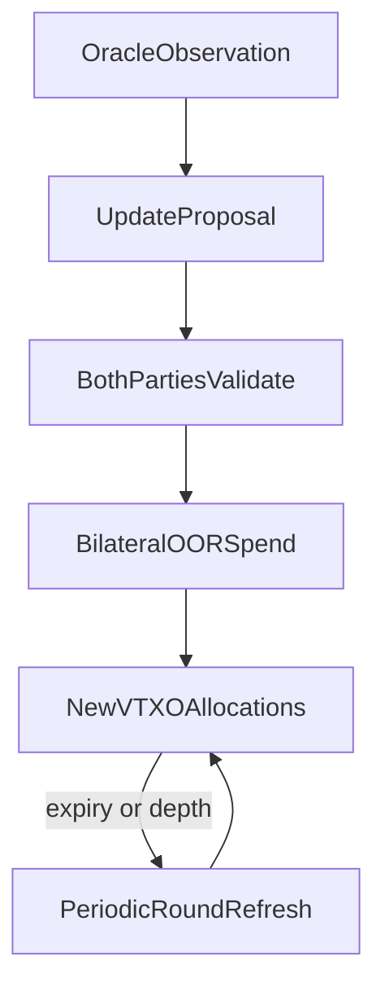

# Stable Ark — Design Note

**Status:** research / pre-PoC  
**Home:** [https://stableark.org](https://stableark.org)  
**Source:** [https://github.com/stableark/stable-ark](https://github.com/stableark/stable-ark)

This note describes a protocol idea for self-custodial, dollar-indexed bitcoin balances on Ark. It is intentionally a design note, not a whitepaper or product announcement. Feedback from Ark implementers and Bitcoin protocol reviewers is welcome.

---

## 1. Abstract

Stable Ark is a protocol that enables self-custodial, dollar-denominated balances on Bitcoin using Ark virtual transaction outputs (VTXOs) instead of Lightning channels. Two participants exchange BTC price risk through coordinated off-chain state updates: one side holds a USD-indexed claim, the other takes leveraged exposure. Settlement remains entirely in bitcoin. Frequent rebalancing uses Ark’s existing out-of-round (OOR) transfer mechanism; Ark rounds periodically renew VTXO expiry, shorten exit paths, and restore the stronger refresh-VTXO security model.

## 2. Motivation

Demand for dollar-stable value on Bitcoin is persistent. Custodial stablecoins meet that demand with issuer and banking trust. Tokenized assets on Bitcoin rails (for example Taproot Assets or Arkade Assets) meet it with issuance and indexing assumptions. A third path—used by [Stable Channels](https://stablechannels.com/) on Lightning—creates *synthetic* dollar exposure by frequently redistributing sats between a stability seeker and a leveraged counterparty inside an overcollateralized channel, without issuing a token.

Stable Channels proves the economic primitive. Ark may improve the operational fit:

- VTXOs are easier to receive and spend than managing Lightning channel liquidity.
- Users do not need inbound liquidity or channel topology for the stability product itself.
- Many positions can share Ark’s batch lifecycle for refresh, collateral adjustment, and settlement.
- Market makers may eventually service many stable users from pooled liquidity rather than one channel per user.

Stable Ark is therefore not merely “Stable Channels ported to Ark.” It aims to use Ark’s payment and refresh semantics as the native settlement fabric for the same economic trade.

## 3. Core principle

> A Stable Ark position is a programmable VTXO arrangement whose redemption value is indexed to USD while settlement remains entirely in bitcoin.

There is no Stable Ark token. There is only bitcoin, allocated between counterparties according to an agreed USD target and an oracle price.

## 4. Actors

| Actor | Role |
| --- | --- |
| **Stable receiver** | Wants a claim whose BTC amount tracks a fixed USD value. |
| **Risk provider** | Posts excess BTC collateral and takes (typically long) BTC price exposure. |
| **Ark operator** | Runs rounds, co-signs OOR checkpoints as required by the Ark deployment, provides liquidity for refresh/boarding—not a custodian of user keys. |
| **Price oracle** | Publishes BTC/USD observations that clients verify independently. |
| **Matching coordinator** (optional) | Helps find counterparties or net pool exposure; must not be required for unilateral exit. |
| **Watchtower** (optional) | Monitors for on-chain spends of position ancestors and assists exits. |

Critical invariant: either participant must be able to exit using locally held recovery material, without trusting the coordinator or the other party’s liveness forever.

## 5. Position model

A position is represented by **two jointly updated VTXOs** (or an equivalent multi-output OOR package) owned by the stable receiver and the risk provider.

At open:

- Agree on `target_usd`, initial oracle price `P0`, fees policy, minimum collateral ratio, liquidation thresholds, and oracle acceptance rules.
- Fund total bitcoin `T` such that the stable side’s sats approximate `target_usd / P0` and the risk side holds the remainder as overcollateralization.
- Assign `position_id` and sequence `n = 0`.

At every valid state `n`:

- `stable_sats(n) + risk_sats(n) + reserved_fees(n) = T_effective(n)` (value conservation, accounting for explicit fees).
- `stable_sats(n) ≈ target_usd / P_n` within agreed rounding and fee policy.
- `risk_sats(n) >= min_collateral(target_usd, P_n, policy)`.
- Sequence numbers increase monotonically; clients reject stale or forked proposals.

Exact dust, fee, and rounding rules are implementation details for the PoC; the design requires conservation and explicit policy rather than ad hoc balance edits.

## 6. Update lifecycle

Two kinds of “refresh” must not be conflated.

| Kind | Purpose | Mechanism |
| --- | --- | --- |
| **Financial refresh** | Reallocate sats after a price change | Bilateral OOR spend |
| **Ark refresh** | Renew expiry, shorten exit chain, restore refresh-VTXO trust | Ark round |



### 6.1 Financial refresh (OOR)

Ark already allows users to transfer value between rounds by extending the off-chain transaction tree (OOR / arkoor). Stable Ark reuses that mechanism for *joint* reallocation:

1. Oracle observation is obtained and verified by both parties.
2. An update proposal computes new allocations and binds `position_id`, sequence, price, timestamp, and policy hash.
3. Both parties validate conservation, collateral, sequence, and oracle rules.
4. A bilateral OOR package consumes the current position VTXOs and creates updated outputs for each party (plus any agreed fee outputs).
5. The operator participates only as required by the underlying OOR protocol (typically checkpoint co-signing).
6. Each party retains the new state and recovery material for unilateral exit.

Ordinary OOR payments are directional (sender → recipient + change). A Stable Ark update is **bilateral**: two active input owners, negotiated outputs. Existing OOR transaction builders that already support multiple checkpoint inputs and multiple recipients are a promising foundation; the missing piece is a durable multi-party signing protocol, not a new consensus layer.

### 6.2 Ark round refresh

Rounds batch users who forfeit old VTXOs and receive new refresh VTXOs. Stable Ark should use rounds to:

- renew expiry before VTXOs become sweepable by the operator,
- compress long OOR chains (lower unilateral-exit cost and fewer ancestor trust assumptions),
- optionally adjust collateral, open/close positions in batch, or net pooled exposure.

Rounds are the settlement and lifecycle layer—not the price-update clock.

## 7. Mechanism mapping

| Stable Channels | Stable Ark |
| --- | --- |
| Lightning channel | Paired position VTXOs |
| Frequent channel balance updates | Bilateral OOR spends |
| Force close | Unilateral exit / unroll package |
| Channel liquidity management | Ark boarding, OOR, and round refresh |
| CLN/plugin coordination | Client-side Stable Ark coordinator + Ark SDK |

## 8. Oracle and allocation

Clients—not the Ark operator—authorize economic validity.

A party accepts an update only if, at minimum:

- the oracle signature (or multi-feed aggregate) verifies under the agreed key set,
- the observation is recent and within max deviation / staleness policy,
- `sequence == previous + 1`,
- `stable_sats` matches `target_usd / price` under the fee/rounding policy,
- `risk_sats` meets collateral requirements,
- total input value conserves into outputs,
- the proposal commits to `position_id` and policy so signatures cannot be replayed across positions or prices.

Oracle data should be bound into the signed update intent even when Bitcoin Script cannot fully enforce the economic rule. Script and pre-signed packages enforce *custody and exit*; clients and the bilateral protocol enforce *indexing*.

Suggested allocation (illustrative):

```
stable_sats = floor(target_usd * 1e8 / price_sats_per_usd)  # policy-defined units
risk_sats   = total_input_sats - stable_sats - fees
require risk_sats >= min_collateral(...)
```

## 9. Liquidation and liveness

If BTC falls quickly, the risk provider’s excess collateral can be exhausted. Waiting for the next Ark round is not an acceptable sole liquidation path.

Stable Ark therefore needs:

1. **Off-round updates** as the normal path to keep the position marked.
2. **Collateral buffers** sized for oracle delay, signing delay, and worst-case time to emergency close.
3. **Emergency cooperative close** via OOR or cooperative leave when thresholds are breached.
4. **Unilateral exit** using the latest valid recovery package if the counterparty or operator stalls.

Policy sketch:

```
required_collateral =
    stable_principal_in_btc
  + volatility_buffer
  + oracle_delay_buffer
  + signing_delay_buffer
  + exit_fee_buffer
```

Exact parameters require simulation; the design only requires that liquidation not depend exclusively on operator round schedule.

## 10. Trust and threat model

### What users keep

- Keys to their VTXOs.
- Ability to unilaterally exit with locally held transaction packages (subject to Ark’s exit costs and delays).

### What OOR adds

OOR spend VTXOs inherit a statechain-like trust assumption: receivers rely on prior owners and the Ark operator not colluding to double-spend an ancestor. Each additional OOR hop lengthens the unilateral exit path and expands the set of earlier parties in the trust set.

Stable Ark improves this relative to arbitrary payment chains by keeping the repeated update chain between **the same two participants and the operator**. It does not eliminate operator honesty assumptions for OOR, nor exit-cost growth. Periodic round refresh is the intended remedy.

### Threats to analyze in the PoC

| Threat | Concern |
| --- | --- |
| Operator + one party collude | Double-spend an older position state |
| Stale state broadcast | Attempt to exit from superseded ancestor |
| Incomplete bilateral update | One party aborts after gaining asymmetric advantage |
| Oracle failure / manipulation | Incorrect allocation or frozen marks |
| Operator censorship | Refusal to co-sign OOR or admit refresh |
| Collateral exhaustion | Price move faster than update/liquidation path |
| Coordinator compromise | Privacy loss or matching failure; must not steal funds |

Fraud monitoring that watches OOR ancestors on-chain (as in mature Ark clients) is directly relevant and should be reused rather than reinvented.

## 11. Why not rounds-as-clock

Requiring every price mark to wait for an Ark round would:

- force high participant availability,
- put liquidations on the operator’s schedule,
- increase fees and operator liquidity demand,
- couple Stable Ark reliability to round cadence.

Ark implementations already treat OOR as the payment path and rounds as refresh. Stable Ark follows that split: **OOR for repricing; rounds for renewal, compression, and batch settlement.**

## 12. Non-goals

- **Not a stablecoin.** No issued token representing dollars.
- **Not a new Ark node.** Do not reimplement rounds, trees, or operator consensus.
- **Not Taproot Assets / Arkade Assets issuance.** Those are complementary “issued stable” paths; Stable Ark is synthetic exposure via bitcoin reallocation.
- **Not mainnet finance.** Pre-PoC research only until threat model and exit paths are demonstrated.

## 13. Implementation stance

Build Stable Ark **against** Ark, not inside the operator, until a missing primitive is proven unavoidable.

Recommended first study target: [Lightning Labs Wavelength](https://github.com/lightninglabs/wavelength), because it already separates durable OOR session FSMs, checkpoint construction, package submit/finalize, VTXO lifecycle, fraud watching, and unilateral unroll. Second/Bark remains an important parallel evaluation path, especially for Rust-first workflows.

Stable Ark-specific logic should live in a separate layer:

- position terms, allocation, oracle verification,
- bilateral update proposal and signing state machine,
- collateral and liquidation policy,
- adapters to an Ark backend interface.

Modify or extend an Ark client/operator only when the PoC shows that bilateral multi-owner OOR cannot be expressed with existing APIs.

## 14. Proof-of-concept milestone

Minimum viable demonstration on regtest with two participants:

1. Open a position (fund paired VTXOs with agreed `target_usd`).
2. Apply a synthetic oracle tick.
3. Complete one bilateral OOR reprice preserving value conservation and collateral checks.
4. Cooperatively close.
5. Separately demonstrate unilateral exit from a live position using only local recovery data.

Failure cases to exercise:

- oracle stale or conflicting feeds,
- counterparty stops signing,
- operator refuses OOR co-sign,
- attempted exit from an old state,
- collateral breach requiring emergency close.

Success criterion: show that the economic mechanism maps onto real Ark OOR/round primitives without a custom node.

## 15. Open questions

1. Can existing OOR flows support **atomic bilateral** signing where neither party gains a usable half-signed advantage?
2. What minimal operator RPC changes, if any, are required beyond today’s checkpoint co-sign model?
3. How should sequence and oracle commitments be encoded for wallet UX and auditability?
4. When should a position be forced into a round refresh (depth, expiry, trust preference)?
5. Can many stable users share pooled risk providers with netting at round boundaries without weakening unilateral exit?
6. What collateral ratios survive realistic BTC volatility given OOR and signing latency?

## 16. Status and next steps

Stable Ark is at the **design note** stage. Next engineering work is a bilateral OOR reprice prototype against an existing Ark client, followed by a written threat-model review.

Project home: [https://stableark.org](https://stableark.org)  
Canonical source: [https://github.com/stableark/stable-ark](https://github.com/stableark/stable-ark)

### Acknowledgements

This design builds on Stable Channels by Tony Klausing, and on the Ark protocol’s OOR and round architecture as documented by Ark contributors and implemented in Second/Bark, Arkade, and Wavelength. Errors and speculative mappings are the author’s alone.
