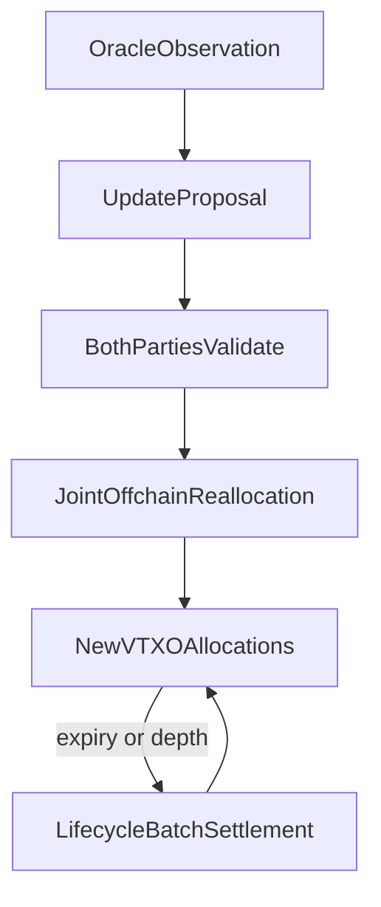
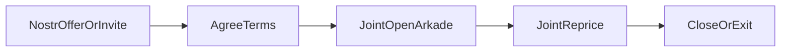

# Stable Ark — Design Note

**Status:** research / pre-PoC (Arkade-first)  
**Home:** [https://stableark.org](https://stableark.org)  
**Source:** [https://github.com/stableark/stableark](https://github.com/stableark/stableark)

This note describes a protocol idea for self-custodial, dollar-indexed bitcoin balances on Bitcoin’s Ark-family offchain VTXO systems. It is intentionally a design note, not a whitepaper or product announcement. Feedback from implementers is welcome.

**Related notes**

- [User onboarding flow](notes/user-onboarding.md) — board → match → open → reprice vs renew → exit
- [Brand assets](assets/) — favicon, logo, OG / GitHub social images
- [Stack comparison](notes/stack-comparison.md) — Bark vs Arkade vs Wavelength (general)
- [Implementation landscape](notes/implementation-landscape.md) — how current stacks differ for Stable Ark
- [Joint multi-input spends](notes/bilateral-atomic-oor.md) — why the joint-update primitive matters

---

## 1. Abstract

Stable Ark enables self-custodial, dollar-denominated balances on Bitcoin using virtual transaction outputs (VTXOs) instead of Lightning channels. Two participants exchange BTC price risk through coordinated offchain state updates: one side holds a USD-indexed claim, the other takes leveraged exposure. Settlement remains entirely in bitcoin.

Frequent rebalancing is a **joint multi-input / multi-output offchain transaction**: both parties spend their current position VTXOs and receive updated allocations in one atomic package, co-signed by the Ark operator as required. Lifecycle renewal (expiry, tree compression, stronger finality) uses each implementation’s batch/settlement path (rounds, batch swaps / intents, etc.).

Terminology differs across implementations. This note uses *joint offchain reallocation* for the financial update. Where a stack calls the same idea “OOR/arkoor,” “Arkade transaction,” or something else, the mapping is noted in [implementation landscape](notes/implementation-landscape.md).

## 2. Motivation

Demand for dollar-stable value on Bitcoin is persistent. Custodial stablecoins meet that demand with issuer and banking trust. Tokenized assets on Bitcoin rails (for example Taproot Assets or Arkade Assets) meet it with issuance and indexing assumptions. A third path—used by [Stable Channels](https://stablechannels.com/) on Lightning—creates *synthetic* dollar exposure by frequently redistributing sats between a stability seeker and a leveraged counterparty inside an overcollateralized channel, without issuing a token.

Stable Channels proves the economic primitive. Ark-family VTXOs may improve the operational fit:

- VTXOs are easier to receive and spend than managing Lightning channel liquidity.
- Users do not need inbound liquidity or channel topology for the stability product itself.
- Many positions can share batch settlement for renewal, collateral adjustment, and exits.
- Market makers may eventually service many stable users from pooled liquidity rather than one channel per user.

Stable Ark is therefore not merely “Stable Channels ported to Ark.” It aims to use VTXO semantics as the native settlement fabric for the same economic trade.

## 3. Core principle

> A Stable Ark position is a programmable VTXO arrangement whose redemption value is indexed to USD while settlement remains entirely in bitcoin.

There is no Stable Ark token. There is only bitcoin, allocated between counterparties according to an agreed USD target and an oracle price.

## 4. Actors

| Actor | Role |
| --- | --- |
| **Stable receiver** | Wants a claim whose BTC amount tracks a fixed USD value. |
| **Risk provider** | Posts excess BTC collateral and takes (typically long) BTC price exposure. |
| **Ark operator** | Co-signs offchain transactions / coordinates batch settlement as required by the deployment—not a custodian of user keys. |
| **Price oracle** | Publishes BTC/USD observations that clients verify independently. |
| **Matching coordinator** (optional) | Helps find counterparties or net pool exposure; must not be required for unilateral exit. **PoC shape:** **Nostr** offer publish/fetch and/or `nprofile` invite (replaceable relays; discovery only—not custody). Soft reputation (WoT, receipts) is post-PoC. A local two-wallet / QR path remains a **dev fallback**. See [user onboarding](notes/user-onboarding.md). |
| **Watchtower** (optional) | Monitors for on-chain spends of position ancestors and assists exits. |

Critical invariant: either participant must be able to exit using locally held recovery material, without trusting the matching coordinator or the other party’s liveness forever.

**Important:** Stable Ark does **not** require a custom operator. Two users running Stable Ark clients should connect to a normal public operator for that stack.

### Permissionless roles and Nostr discovery

Stable Ark does **not** run a centralized liquidity desk that users must join. At the protocol layer, roles are symmetric: any peer who can board BTC, meet collateral policy, and keep signing may seek stability **or** provide risk. Specialized always-on LPs will likely win retail share on uptime and UX—that is market structure, not a Stable Ark–issued seat.

Counterparties find each other over **Nostr** (replaceable relays) or out-of-band invites, then settle with joint VTXO updates on a normal public Ark operator. There is no mandatory Stable Ark matching server. An HTTPS matcher, if added later, stays optional and non-custodial (same trust box as relays: privacy / matching failure, not fund theft).

**Censorship resistance (scoped):** blocking one relay or one curated allowlist does not stop pairing—users can switch relays or use invites. This claim does **not** remove Ark operator co-sign or liveness assumptions; operator downtime still freezes collaborative updates. Nostr is for **who finds whom**, not for marks, tip state, or exit packages. Collateral, oracle policy, and unilateral exit remain the security model.

Economic terms (`target_usd`, fees, collateral above a client floor, oracle allowlist) are **negotiated**; boarding, co-sign, VTXO renewal, and exit packages are **inherited from the Ark stack**—see [user onboarding](notes/user-onboarding.md). Client-side curated LP lists are optional convenience, not a protocol permission bit.

## 5. Position model

A position is represented by **two jointly updated VTXOs** owned by the stable receiver and the risk provider.

At open:

- Agree on `target_usd`, initial oracle price `P0`, fees policy, minimum collateral ratio, liquidation thresholds, and oracle acceptance rules.
- Fund total bitcoin `T` such that the stable side’s sats approximate `target_usd / P0` and the risk side holds the remainder as overcollateralization.
- Assign `position_id` and sequence `n = 0`.

At every valid state `n`:

- `stable_sats(n) + risk_sats(n) + reserved_fees(n) = T_effective(n)` (value conservation, accounting for explicit fees).
- `stable_sats(n) ≈ target_usd / P_n` within agreed rounding and fee policy.
- `risk_sats(n) >= min_collateral(target_usd, P_n, policy)`.
- Sequence numbers increase monotonically; clients reject stale or forked proposals.

Exact dust, fee, and rounding rules are implementation details for the PoC; the design requires conservation and explicit policy rather than ad hoc balance edits.

**Verifying counterparty liquidity:** Nostr/offer capacity claims are soft. Hard assurance is mutual inspection of **boarding inputs** in the joint open transaction (user principal vs LP principal + overcollateral) before either signs—see [user onboarding §6](notes/user-onboarding.md#6-open-position-dual-fund--paired-vtxos). Ongoing marks re-check `min_collateral` on the tip risk VTXO.

## 6. Update lifecycle

Two kinds of “refresh” must not be conflated.

| Kind | Purpose | Mechanism |
| --- | --- | --- |
| **Financial refresh** | Reallocate sats after a price change | Joint multi-input / multi-output offchain tx |
| **Lifecycle refresh** | Renew expiry, shorten exit path, restore stronger settlement security | Batch settlement (rounds / batch swaps / intents) |

Product UX and liveness (LP always-on vs intermittent stable user; ~hourly round *opportunity* vs ~monthly VTXO *lifetime*; why live joint reprice rather than DLC-style price-grid presign for v1) are spelled out in [user onboarding](notes/user-onboarding.md).



### 6.1 Financial refresh (joint offchain reallocation)

Ideal update shape:

```text
Alice position VTXO + Bob position VTXO
        →
new Alice allocation + new Bob allocation
```

Both parties are active input owners. The operator co-signs as required by the stack. The transaction is not mined in the collaborative path; it extends offchain VTXO state.

Protocol steps:

1. Oracle observation is obtained and verified by both parties.
2. An update proposal computes new allocations and binds `position_id`, sequence, price, timestamp, and policy hash.
3. Both parties validate conservation, collateral, sequence, and oracle rules.
4. Both sign their inputs; the operator co-signs.
5. Each party retains the new state and recovery material for unilateral exit.

**Fallback (if a stack only supports one-input payments):** the party who owes can send a directional payment, and both wallets treat it as a mark only if it matches policy. Lifecycle batch settlement later consolidates fragments. This is acceptable for early experiments on one-input-only stacks, but it is not the preferred state model.

### 6.2 Lifecycle refresh (batch settlement)

Depending on the implementation, users periodically forfeit old VTXOs and receive renewed outputs via rounds or intent-driven batch swaps. Stable Ark should use that path to:

- renew expiry before funds become sweepable under operator policy,
- compress long offchain chains (lower unilateral-exit cost),
- optionally adjust collateral, open/close positions in batch, or net pooled exposure.

Batch settlement is the lifecycle layer—not the price-update clock.

## 7. Mechanism mapping

| Stable Channels | Stable Ark |
| --- | --- |
| Lightning channel | Paired position VTXOs |
| Frequent channel balance updates | Joint offchain reallocations |
| Force close | Unilateral exit package |
| Channel liquidity management | Boarding + offchain txs + batch settlement |
| CLN/plugin coordination | Client-side Stable Ark logic + stack SDK |

## 8. Oracle and allocation

Clients—not the Ark operator—authorize economic validity.

A party accepts an update only if, at minimum:

- the oracle signature (or multi-feed aggregate) verifies under the agreed key set,
- the observation is recent and within max deviation / staleness policy,
- `sequence == previous + 1`,
- `stable_sats` matches `target_usd / price` under the fee/rounding policy,
- `risk_sats` meets collateral requirements,
- total input value conserves into outputs,
- the proposal commits to `position_id` and policy so signatures cannot be replayed across positions or prices.

Oracle data should be bound into the signed update intent even when Bitcoin Script cannot fully enforce the economic rule. Script and pre-signed packages enforce *custody and exit*; clients and the bilateral protocol enforce *indexing*.

Suggested allocation (illustrative):

```
stable_sats = floor(target_usd * 1e8 / price_sats_per_usd)  # policy-defined units
risk_sats   = total_input_sats - stable_sats - fees
require risk_sats >= min_collateral(...)
```

## 9. Liquidation and liveness

If BTC falls quickly, the risk provider’s excess collateral can be exhausted. Waiting for the next batch settlement is not an acceptable sole liquidation path.

Stable Ark therefore needs:

1. **Offchain joint (or directional) updates** as the normal path to keep the position marked.
2. **Collateral buffers** sized for oracle delay, signing delay, and worst-case time to emergency close.
3. **Emergency cooperative close** when thresholds are breached.
4. **Unilateral exit** using the latest valid recovery package if the counterparty or operator stalls.

Policy sketch:

```
required_collateral =
    stable_principal_in_btc
  + volatility_buffer
  + oracle_delay_buffer
  + signing_delay_buffer
  + exit_fee_buffer
```

Exact parameters require simulation; the design only requires that liquidation not depend exclusively on operator batch schedule.

## 10. Trust and threat model

### What users keep

- Keys to their VTXOs.
- Ability to unilaterally exit with locally held transaction packages (subject to the stack’s exit costs and delays).

### What collaborative offchain spends add

Collaborative offchain spends typically inherit a statechain-like trust assumption: later holders rely on prior owners and the operator not colluding to double-spend an ancestor. Each additional hop can lengthen the unilateral exit path.

Stable Ark improves this relative to arbitrary payment chains by keeping the repeated update chain between **the same two participants and the operator**. It does not eliminate operator honesty assumptions, nor exit-cost growth. Lifecycle batch settlement is the intended remedy.

### Threats to analyze in the PoC

| Threat | Concern |
| --- | --- |
| Operator + one party collude | Double-spend an older position state |
| Stale state broadcast | Attempt to exit from superseded ancestor |
| Incomplete bilateral update | One party aborts after gaining asymmetric advantage |
| Oracle failure / manipulation | Incorrect allocation or frozen marks |
| Operator censorship | Refusal to co-sign or admit settlement |
| Collateral exhaustion | Price move faster than update/liquidation path |
| Coordinator compromise | Privacy loss or matching failure; must not steal funds |

## 11. Why not batch-settlement-as-clock

Requiring every price mark to wait for a round / batch swap would:

- force high participant availability,
- put liquidations on the operator’s schedule,
- increase fees and operator liquidity demand,
- couple Stable Ark reliability to batch cadence.

Stable Ark follows: **joint offchain reallocation for repricing; batch settlement for renewal, compression, and stronger finality.**

## 12. Non-goals

- **Not a stablecoin.** No issued token representing dollars.
- **Not a new Ark operator.** Do not reimplement operator consensus or batch coordination.
- **Not Taproot Assets / Arkade Assets issuance.** Those are complementary “issued stable” paths; Stable Ark is synthetic exposure via bitcoin reallocation.
- **Not mainnet finance.** Pre-PoC research only until threat model and exit paths are demonstrated.

## 13. Implementation stance

Build Stable Ark **against** an existing stack, not inside the operator, until a missing primitive is proven unavoidable.

### Primary target: Arkade

[Arkade](https://docs.arkadeos.com) is the first implementation target. Current implementer guidance (July 2026):

- Offchain transactions follow a **Bitcoin UTXO model** (multi-input / multi-output).
- Distinct owners can sign distinct inputs in the **same** Arkade transaction; the operator co-signs; the tx is not broadcast to miners in the collaborative path.
- Sending is not modeled as in-round payments; lifecycle uses an **intent / batch-swap** system rather than requiring periodic rounds to move value.
- SDKs exist for TypeScript, Go, Rust, and C# ([docs](https://docs.arkadeos.com), [demos](https://github.com/arkade-os/demos)).

This matches Stable Ark’s preferred joint-reallocation shape without a custom operator.

### Other stacks (summary)

| Stack | Joint multi-owner offchain update | Notes |
| --- | --- | --- |
| **Arkade** | Supported (per implementers + docs model) | Primary PoC target |
| **Second / Bark** | OOR payments are **one-input** today | Multi-party possible in a round; two-party VTXO policies possible but would need added support; nested MuSig2 (e.g. Stutxo-style) discussed as a way to hide structure from the server |
| **Wavelength** | Mature durable OOR client FSMs | Evaluate against a Wavelength-compatible gateway only; strong reference for session durability patterns |

Details: [implementation landscape](notes/implementation-landscape.md).

Stable Ark-specific logic stays in a separate layer:

- position terms, allocation, oracle verification,
- bilateral update proposal and signing state machine,
- collateral and liquidation policy,
- adapters behind a small `ArkBackend` interface.

## 14. Proof-of-concept milestone

Minimum viable demonstration (prefer Arkade regtest / mutinynet) with two participants:



1. Publish or fetch a Stable Ark **Nostr** offer (or `nprofile` invite carrying the same terms) on public relays.
2. Agree negotiated terms locally.
3. Open a position (fund paired VTXOs with agreed `target_usd`).
4. Apply a synthetic oracle tick.
5. Complete one **joint** reallocation (Alice input + Bob input → new allocations) with conservation and collateral checks.
6. Cooperatively close.
7. Separately demonstrate unilateral exit from a live position using only local recovery data.

A local two-wallet match without Nostr remains acceptable as a **dev fallback** while wiring Arkade; the PoC headline path includes Nostr discovery.

Failure cases to exercise:

- oracle stale or conflicting feeds,
- counterparty stops signing,
- operator refuses co-sign,
- attempted exit from an old state,
- collateral breach requiring emergency close,
- relay unreachable / offer not found (switch relay or fall back to invite).

Success criterion: show the economic mechanism on a **public/normal operator**, with **Nostr** used for discovery, without Stable Ark server-side custody or matching monopoly.

## 15. Open questions

1. On Arkade: what is the minimal two-wallet signing coordinator for submit/finalize when inputs have different owners?
2. How should sequence and oracle commitments be encoded for wallet UX and auditability?
3. When should a position be forced into lifecycle settlement (depth, expiry, trust preference)?
4. Can many stable users share pooled risk providers with netting at batch boundaries without weakening unilateral exit?
5. What collateral ratios survive realistic BTC volatility given signing latency?
6. On Second/Bark: is the preferred long-term path round-based multi-party, two-party VTXO policies, nested MuSig2, or multi-input OOR?

## 16. Status and next steps

Stable Ark is at the **design note** stage with an **Arkade-first** PoC plan that includes **Nostr discovery**:

1. Intro / DevRel with Arkade; exercise multi-owner Arkade transactions from the SDK/demos.
2. Wire Nostr offer publish/fetch (or `nprofile` invite) as the matching path.
3. Implement a two-wallet joint reprice with a fake oracle.
4. Write down the concrete threat model against that PoC.
5. Keep Second/Bark and Wavelength as compatibility targets behind an adapter if/when primitives allow.

Project home: [https://stableark.org](https://stableark.org)  
Canonical source: [https://github.com/stableark/stableark](https://github.com/stableark/stableark)

### Acknowledgements

This design builds on Stable Channels by Tony Klausing, and on Ark-family VTXO systems as implemented by Arkade (Ark Labs), Second/Bark, and Lightning Labs Wavelength. Thanks to implementers who clarified multi-input offchain transaction support and OOR structural constraints. Errors and speculative mappings are the author’s alone.
