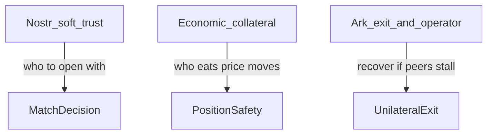
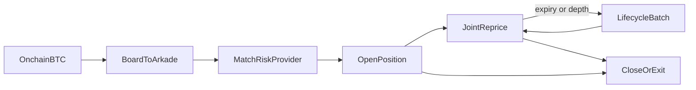
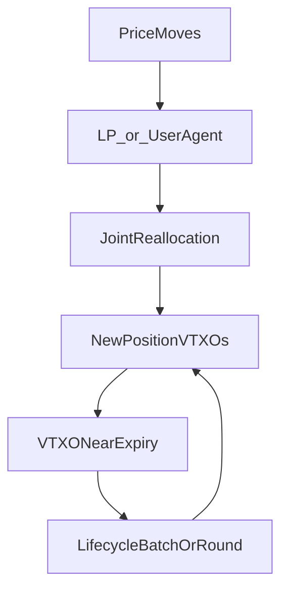

# Stable Ark — User onboarding flow

**Audience:** product / protocol readers (how a user gets from BTC to “stable sats”)  
**Status:** design note for Arkade-first PoC and early product  
**Parent:** [DESIGN.md](../DESIGN.md)

This note describes the end-to-end journey for a **stable receiver** (you have bitcoin, you want a USD-indexed claim). Risk-provider (LP) steps are the mirror image. No application code is implied yet.

**Related:** [implementation landscape](implementation-landscape.md) · [stack comparison](stack-comparison.md) · [joint multi-input spends](bilateral-atomic-oor.md)

---

## Guiding principles

1. **Negotiate what is economic; inherit what is Bitcoin/Ark.** Fees, collateral above a floor, oracle policy, and mark cadence are bilaterally agreed. Boarding, operator co-sign, VTXO expiry/renewal, and unilateral exit use the **stack as designed**—no custom Stable Ark operator, no reinvented settlement clock.
2. **PoC stays thin.** Prove open → joint reprice → close/exit on Arkade. Skip marketplace, real oracles, watchtowers, pooled LP, spend-while-stable, and price-grid presign unless needed to demo safety.
3. **Nostr when it fits.** Discovery, soft LP trust, invite / `nprofile`, optional session bootstrap—not marks, not custody, not the tip ledger.
4. **Safety, good UX, easy for the user.** Auto lifecycle renew; LP expected always-on; retail defaults to curated LPs; advanced path = any peer; one clear terms summary before sign; force-exit disclosed as “you get sats, peg stops.”

### Negotiated vs fixed

| Negotiated (user ↔ LP) | Fixed / inherited (don’t reinvent) |
| --- | --- |
| `target_usd`, fee split / LP fee | Arkade board + joint tx + operator co-sign |
| Min collateral **at or above** client floor | VTXO batch expiry + stack renewal / intent path |
| Oracle feed set & staleness (from allowlist) | Conservation of sats; tip = spent prior VTXOs |
| Who initiates marks; signing timeouts | Unilateral exit package format of the stack |
| Session endpoint / Nostr relay prefs | Same-operator / same-stack requirement |

---

## Mental model

There is no Stable Ark token. The user holds a **VTXO whose sat amount tracks a USD target**, paired with a **risk provider** who posts overcollateralization and takes BTC price risk. Settlement is always bitcoin. The Ark operator only co-signs; it does not custody Stable Ark economics.

**Permissionless risk providers:** anyone who can board BTC, meet collateral policy, and keep signing can be an LP. There is no protocol-level license. Specialized LP services will likely dominate retail UX—that is market structure, not a protocol monopoly. Wallets may **curate defaults** (allowlists, WoT); curation is a client choice, not a settlement permission bit.

### Trust stack

Do not collapse these layers:



| Layer | What it does | What it does **not** do |
| --- | --- | --- |
| **Nostr soft trust** | Helps pick an LP (npub, NIP-05, WoT, receipts) | Does not move sats, stop a bad mark, or replace exit |
| **Economic collateral** | Absorbs BTC price risk so the stable claim stays ~USD | Does not prove the LP will stay online |
| **Ark exit + operator co-sign rules** | Lets you leave without the other party forever | Does not keep the peg marked while you are offline |

### Who deposits what

| Party | What they put in | Role |
| --- | --- | --- |
| **Stable receiver** | ~`target_usd / P` sats into the position | Becomes the **stable claim** (funding the product, not an extra “trust bond”) |
| **Risk provider (LP)** | That principal **plus excess overcollateral** | Buffer that moves with price; LP takes leveraged BTC exposure |

Nostr reputation ranks counterparties; it must **never** justify under-collateralizing the LP. Optional behavior bonds (either side) are later / non-v1 and do not replace LP overcollateral or unilateral exit.



---

## Happy path (stable receiver)

### 1. Prep wallet and network

- Open a **Stable Ark client** (Arkade SDK underneath; TypeScript PoC later).
- Connect to a **normal public Arkade operator** (no custom Stable Ark custody server).
- Generate keys; **back up seed** (and later, after open, the latest exit package—see backup below).
- Both parties must use a **compatible same-stack operator URL**; cross-ecosystem gateways are not assumed ([stack comparison](stack-comparison.md)).

### 2. Deposit = board BTC into Ark

- Send on-chain BTC via the wallet’s boarding flow.
- After boarding confirms under Arkade rules, the user holds spendable **VTXOs** (not yet “stable”).
- UX copy: **“Deposit to Ark”**—not “mint stablecoins.” Optional sat + ~USD spot for orientation only.

### 3. Choose stable intent

- Enter **target USD** (e.g. keep $500 stable).
- Review negotiable defaults: oracle allowlist, max staleness, min collateral (at/above client floor), fees, who initiates marks, signing timeout.
- Client shows **indicative** sats for the stable side (`target_usd / P`) and that the LP must post additional collateral.

### 4. Find a counterparty (matching)

**PoC / v1 (default):** invite link, QR, or two local wallets sharing `position_id` + terms hash. No marketplace required.

**Later — preferred discovery: Nostr** (optional matching layer; compromise = bad match / privacy leak, not fund theft):

| Use Nostr for | Do not use Nostr for |
| --- | --- |
| LP offers / stable bids, intro handshake | Holding keys or VTXOs |
| Soft reputation (npub, NIP-05, WoT) | Binding economic validity |
| Session bootstrap to exchange endpoints | Joint reprice / operator co-sign |
| Optional `nprofile` / `naddr` invites | Unilateral exit packages |

Sketch: LPs publish offers (collateral band, fee, policy hash, operator URL, npub); users reply privately or via bid; both verify terms locally; then a **dedicated session** for open + marks (Nostr can signal; should not be the sole hot path for every reprice). Multi-relay; relays untrusted.

Caveats: spam/fake liquidity; public bids leak size (prefer DM-to-offer); PoC stays invite-first.

HTTPS curated matching remains valid with the same non-custodial trust box.

#### Other Nostr uses (soft only)

| Signal | Role |
| --- | --- |
| Persistent npub, NIP-05 | Continuity / brand |
| WoT / curated allowlist | Retail defaults |
| Performance cards / opt-in close receipts | Soft history (gameable alone) |
| Presence, capacity bands, operator compatibility | Discovery |
| Watchtower discovery (later) | Same non-custodial box |

**Non-goals for Nostr:** dispute court over sats; position ledger; proving reserves without cryptographic / on-Ark evidence.

| Phase | Nostr |
| --- | --- |
| PoC | Optional `nprofile` invite |
| Early product | Offers + NIP-05 / curated LP list |
| Later | WoT + receipts + watchtower discovery |

### 5. Negotiate and lock terms

Agree before funds enter the position:

| Field | Example |
| --- | --- |
| `target_usd` | 500 |
| Oracle rules | allowlisted feeds, max age, max deviation |
| Collateral | min ratio (≥ client floor), liquidation threshold |
| Fees | board / mark / renew / close; LP fee |
| Session | direct, relay, or LP API; timeouts |

One summary screen: “You keep ~$500 of BTC value; counterparty posts X sats collateral; if BTC drops, they absorb first.”

**Force-exit disclosure (required before open):** if the LP or operator stalls, you can exit with the **latest recovery package**. You receive **bitcoin (sats)** subject to Ark exit delay/cost—the **USD peg stops** at exit. Offline time can leave the claim unmarked until a mark or exit.

**Backup (required):** seed **and** latest unilateral exit package (+ position terms). Seed alone may be insufficient if recovery packages are not backed up.

### 6. Open position (dual fund → paired VTXOs)

Preferred Arkade joint shape:

```text
User boarding VTXO(s) + LP boarding VTXO(s)
        →
stable receiver position VTXO + risk provider position VTXO
(+ change if needed)
```

1. Review open at `P0`, sequence `n = 0`.
2. Sign your input(s).
3. Wait for counterparty + operator co-sign.
4. Store **position state + unilateral exit package**; confirm backup.

Primary UI balance becomes **stable USD** (sats underneath), unless leftover free VTXOs remain outside the position.

### 7. Live: updates, liveness, expiry

Two clocks (see [DESIGN.md](../DESIGN.md) §6):

| Clock | Purpose | Who must be reachable |
| --- | --- | --- |
| **Financial refresh** | Reallocate sats after price moves | Both parties (or agents) + operator co-sign |
| **Lifecycle refresh** | Renew expiry / compress exit path | Stack batch / intent (Arkade) or round (Bark)—**not** the price mark |



**Always online?** Not both, not 24/7.

- **LP:** expected always-on agent (fee pays for liveness).
- **Stable user:** intermittent; push-to-sign or limited auto-agent (policy-bound marks only). Too long offline → Needs signature → Collateral warning → emergency close / unilateral exit.
- **Operator:** needed for collaborative co-sign and lifecycle admission; downtime freezes collaborative updates (local exit package remains).

**Price update path:** verify oracle → propose allocations → both sign → operator co-signs → new paired VTXOs; store latest exit package. Rounds are **not** required per tick.

**Signing race sketch (short):** one in-flight proposal per `position_id`; monotonic sequence; proposal timeout → cancel / no tip change; either party may abort before operator finalize; never blind-sign; full session FSM later (Wavelength-style durability as reference).

**VTXO expiry (order-of-magnitude; operator-configurable):**

| Stack | Renew opportunity | Typical lifetime |
| --- | --- | --- |
| **Bark / Second** | Rounds ~every 1–2 hours | ~30 days board/refresh VTXOs |
| **Arkade** | Batch swaps / intents on demand | Batch expiry; SDK often renews ~3 days before expiry |
| **Wavelength** | Operator rounds via client FSM | Depends on its gateway |

Peg updates whenever a joint reprice completes. Lifecycle renew is separate UX: “Renewing Ark security…” vs “Updating dollar peg.” Auto-renew before expiry.

**Presign price grids:** not v1. Live joint reprice is the default. DLC-style bands are research (oracle-bound packages + revoke superseded grids).

**Cheating prevention:** conservation + collateral checks before sign; spend prior VTXOs (one tip); shared oracle rules; latest exit package + optional watchtower; buffers for signing delay. Presigning does not remove oracle policy or tip-state rules.

**Status chips:** Healthy · Needs signature · Collateral warning · Liquidation risk · Offline counterparty · Renew soon · Operator unreachable.

**Liquidation (stub):** thresholds negotiable above a client floor; UX path warning → emergency cooperative close → unilateral exit. Exact ratios TBD—do not invent production numbers here ([DESIGN.md](../DESIGN.md) §9).

**Oracle (PoC):** fake / scripted price. Product: negotiate feeds from a client allowlist; refuse stale/conflicting observations.

**Operator issues (short UX):** downtime → collaborative updates pause, use exit if needed; refusal to co-sign → treat as censorship, exit; deeper collusion threats stay in [DESIGN.md](../DESIGN.md) §10.

### 8. Spend, top-up, resize (later)

Out of PoC: partial close / pay from stable VTXO; increase `target_usd`; LP top-up without changing target.

### 9. Leave

**Cooperative close:** unwind at oracle price (or agreed sats); joint tx to free VTXOs or board-out on-chain.

**Unilateral exit:** execute latest local recovery package if LP or operator stalls (see disclosure in §5).

---

## Risk-provider mirror

Board BTC → accept invite or advertise → post collateral-heavy VTXO → auto-sign marks within policy → earn fee / take BTC exposure → close or liquidate if collateral breaches.

PoC LP = second wallet with a large collateral slider (proves anyone-can-be-LP).

**Why permissionless even if pros win:** bilateral trade, not an issued seat; no Stable Ark gatekeeper; friends/OTC can provide stability; pros compete on uptime/fees/Nostr reputation without protocol privilege. Retail UX may still default to curated LPs with an advanced “any npub / invite” path.

---

## What the user never does

- Trust the Ark operator with Stable Ark math (clients enforce indexing).
- Require a Stable Ark–specific operator.
- Mint or redeem an issued dollar token.
- Wait for a batch/round to reprice (financial ≠ lifecycle refresh).

---

## PoC vs product

| Step | PoC | Product |
| --- | --- | --- |
| Deposit | Manual Arkade board | In-app board with progress |
| Matching | Invite / two local wallets | Nostr offers + curated defaults |
| Oracle | Fake / scripted | Allowlisted multi-feed + staleness UI |
| Updates | Button “apply tick” | LP agent + user push / limited auto-agent |
| Exit | Scripted unilateral path | Guided wizard + backup reminders |
| Fees | Negotiated categories only | Negotiated with clear conservation accounting |

**Fee categories (negotiated; no fixed schedule here):** boarding, joint mark, lifecycle renew, cooperative close, LP service fee (bps or flat).

---

## Later appendix (not blocking PoC)

- Watchtowers (discovery via Nostr when built)
- Spend-while-stable, rematch/rotate LP, pooled LP / netting
- Privacy of Nostr offers and repeated joint txs
- Encoding of `position_id` / sequence / oracle commit
- Arkade two-wallet submit/finalize coordinator details
- Price-grid presign research
- Marketing language (“dollar-indexed claim,” not issued stablecoin)
- LP inventory / quoting for pros
- Delegation scopes: renew-only vs mark-signing agents

---

## See also

- [DESIGN.md](../DESIGN.md) — position model, threats, PoC milestone
- [implementation landscape](implementation-landscape.md) — Arkade-first primitives
- [bilateral-atomic-oor.md](bilateral-atomic-oor.md) — why joint multi-input updates matter
